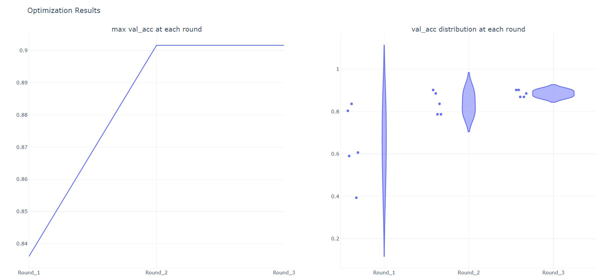
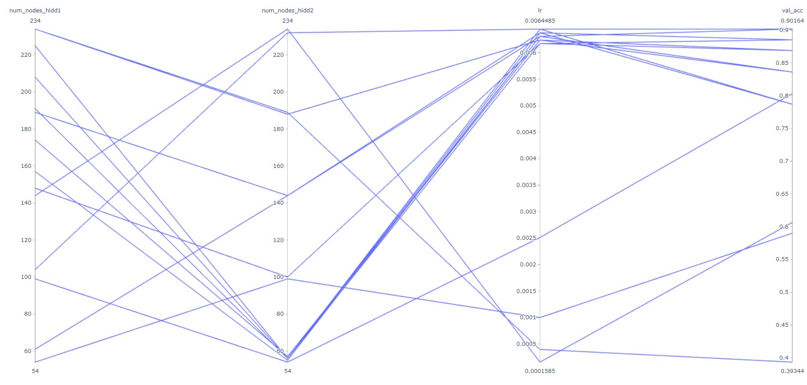

# *aisaratuners user guide*


## 1. aisaratuners.aisara_keras_tuner

a module used for the hyperparameter optimization for keras deep learning librarary models.


## 1.1 aisaratuners.aisara_keras_tuner.Hp

### Class aisaratuners.aisara_keras_tuner.Hp()

Instantiate a hyperparameter class that acts as a container for the user’s defined hyperparameters.


### 1.1.1 aisaratuners.aisara_keras_tuner.Hp.numrange

**numrange(name=None, min=None, max=None, type='linear')**

A function which is used to define the numerical hyperparameters.

**Parameters:**
* name: str

    assigning name to the of the defined hyperparameter
* min: int, float

    minimum value assigned for the defined hyperparameter
* max: int, float

    maximum value assigned for the defined hyperparameter
* type: str, default 'linear'

    assign the type of defined hyperparameter, it can be either 'linear' or 'log'. 'log' type is recommended to be used for optimizer learning rate

**Examples**
```python
from aisaratuners import aisara_keras_tuner as akt
my_hps = akt.Hp()
hp_1 = my_hps.numrange(name= 'numer_hidden_layers', min=3, max=6, type='linear')
hp_2 = my_hps.numrange(name= 'batch_size', min=10, max=20)
hp_3 = my_hps.numrange(name= 'lr', min=0.0001, max=0.01, type='log')
```


### 1.1.2 aisaratuners.aisara_keras_tuner.Hp.remove_hp

**remove_hp(name=None)**

A function which is used to delete a hyperparameter from Hp class.

**Parameters:**
* name: str

    the name to the of the hyperparameter to be deleted
    
**Examples**
```python
from aisaratuners import aisara_keras_tuner as akt
my_hps = akt.Hp()
hp_1 = my_hps.numrange(name= 'numer_hidden_layers', min=3, max=6, type='linear')
hp_2 = my_hps.numrange(name= 'batch_size', min=10, max=20)
hp_3 = my_hps.numrange(name= 'lr', min=0.0001, max=0.01, type='log')
.
.
.
my_hps. remove_hp('batch_size')
```


### 1.1.3 aisaratuners.aisara_keras_tuner.Hp.search_space_boundaries

#### Property search_space_boundaries

Return pandas dataframe that shows the initial search space boundaries.

**Examples**
```python
from aisaratuners import aisara_keras_tuner as akt
my_hps = akt.Hp()
hp_1 = my_hps.numrange(name= 'numer_hidden_layers', min=3, max=6, type='linear')
hp_2 = my_hps.numrange(name= 'batch_size', min=10, max=20)
hp_3 = my_hps.numrange(name= 'lr', min=0.0001, max=0.01, type='log')
print(my_hps.search_space_boundaries)
```
**output**


## 1.2 aisaratuners.aisara_keras_tuner.HpOptimization

### Class aisaratuners.aisara_keras_tuner.HpOptimization(hp_class=None, model_func=None, opti_paras=None, opti_objects=None, num_trials=5, rounds=3, mode = 'c', aisara_seed = 'variable')

Instantiate aisara optimizer. There will be multiple Keras models for total **n** number of trials where **n** is num_trials*rounds. The search space will be reduced into small solution areas according to the number of rounds and each round will be investigated with the multiple trials as provided by the user.

**Parameters:**
* hp_class: aisaratuners.aisara_keras_tuner.Hp class

    aisara hyperparameter class that contains user’s defined hyperparameters
*  model_func:

    a function where keras model is defined and it returns the model and the history
* opti_paras: iterable (list, tuple)

    iterable contains the optimization parameters, the first one is the main parameter for optimization and the second one is used as a supporting parameter [parameter1, parameter2] or (parameter1, parameter2)
    
    parameter1 for classification can be 'val_acc', 'val_mae', 'val_mse', 'acc', 'mae', 'mse'
    
    parameter2 for classification can be 'val_loss', 'loss'
* opti_objects: iterable (list, tuple)

    iterable contains the objective for optimization parameters [objective1, objective2] or (objective1, objective2)
    
    objective1 can be either 'min', 'max'
    
    objective2 can be either  'min', 'max'
* num_trials: int, default 5

    number of trials per each round, the recommended value should be between 3-10.  
* rounds: int or str,  default 3

    number of rounds in which the search space is reduced.
    
    rounds can also be set to 'aisara_auto' where the number of rounds is chosen automatically until the best hyperparameter combinations is achieved (this option takes a longer time).
* mode: str, default 'c'

    the mode in which aisara technology is utilized for hyperparameter optimization. It can be either 'c' or 'p' where 'c' is for commercial use and aisara hyperparameter tuning API key should be provided while 'p' is for free private use.
* api_key: str

    it should be provided when aisaratuners is  running for commercial use
    
    aisara hyperparameter tuning API key can be obtained from [here](https://rapidapi.com/aisara-technology-aisara-technology-default/api/aisara-hyperparameter-tuning)
     
* aisara_seed: str, default 'variable'

    the seed value during optimization, it can be either 'variable' or 'fixed'
    
**Examples**
```python
from aisaratuners import aisara_keras_tuner as akt

# hp_class
my_hps = akt.Hp()
hp_1 = my_hps.numrange(name= 'numer_hidden_layers', min=3, max=6, type='linear')
hp_2 = my_hps.numrange(name= 'batch_size', min=10, max=20)
hp_3 = my_hps.numrange(name= 'lr', min=0.0001, max=0.01, type='log')

# model_func
def myfunc(comp, k):
    model = Sequential()
    model.add(Dense(200, activation ='relu',input_shape=[len(train_dataset.keys())]))
    for layer in range(comp['num_layers'][k]):
        model.add(Dense(100, activation = 'relu'))
    model.add(Dropout(0.2))
    model.add(Dense(1, activation='sigmoid'))
    model.compile(loss='binary_crossentropy', optimizer=optimizers.SGD(comp['lr'][k]), metrics=['acc'])
    history = model.fit(normed_train_data, train_labels, epochs=comp['epoch'][k], batch_size=comp['batch_size'][k], validation_data=(normed_test_data,test_labels))
    return model, history

# commercial use
optimizer = akt.HpOptimization(my_hps, myfunc, ['val_acc','val_loss'], ['max','min'], 5, 3, mode='c', api_key='11441hjfdfd')

# free private use 
optimizer = akt.HpOptimization(my_hps, myfunc, ['val_acc','val_loss'], ['max','min'], 5, 3, mode='p')
```


### 1.2.1 aisaratuners.aisara_keras_tuner.HpOptimization.run_opti

#### Function run_opti()

A function to start the search for the best hyperparameter configuration, it returns the model training results, search space boundaries, hyperparameters combination, and the optimization results per each round.

**Examples**
```python
optimizer = akt.HpOptimization(my_hps, myfunc, ['val_acc','val_loss'], ['max','min'], 5, 3, mode='p')
optimizer.run_opti()
```

### 1.2.2 aisaratuners.aisara_keras_tuner.HpOptimization.opti_results

#### Property opti_results

Return a dataframe that contains the optimization results for all the rounds along with the model ID.

**Examples**
```python
optimizer = akt.HpOptimization(my_hps, myfunc, ['val_acc','val_loss'], ['max','min'], 5, 3, mode='p')
optimizer.run_opti()
print(optimizer.opti_results)
```
**output**


### 1.2.3 aisaratuners.aisara_keras_tuner.HpOptimization.best_model_hps

#### Property best_model_hps

Return the hyperparameter configuration that yields the best value for the main optimization parameter.

**Examples**
```python
optimizer = akt.HpOptimization(my_hps, myfunc, ['val_acc','val_loss'], ['max','min'], 5, 3, mode='p')
optimizer.run_opti()
print(optimizer.best_model_hps)
```
**output**


### 1.2.4 aisaratuners.aisara_keras_tuner.HpOptimization.best_model

### Property best_model

Return the hyperparameter configuration that yields the best value for the main optimization parameter.

**Examples**
```python
optimizer = akt.HpOptimization(my_hps, myfunc, ['val_acc','val_loss'], ['max','min'], 5, 3, mode='p')
optimizer.run_opti()
best_model = optimizer.best_model
```


### 1.2.5 aisaratuners.aisara_keras_tuner.HpOptimization.plot_opti_results

#### Function plot_opti_results()

return a visual representation of the optimization results for all the rounds.

**Examples**
```python
optimizer = akt.HpOptimization(my_hps, myfunc, ['val_acc','val_loss'], ['max','min'], 5, 3, mode='p')
optimizer.run_opti()
optimizer.plot_opti_results()
```
**output**






### 1.2.6 aisaratuners.aisara_keras_tuner.HpOptimization.plot_search_space

#### Function plot_search_space()

return a visual representation for the hyperparameters solution space (2D, 3D).

**Examples**
```python
optimizer = akt.HpOptimization(my_hps, myfunc, ['val_acc','val_loss'], ['max','min'], 5, 3, mode='p')
optimizer.run_opti()
optimizer.plot_opti_results()
```
**output**


